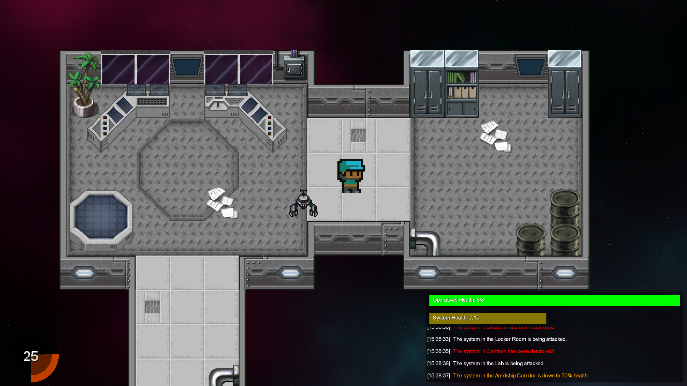

# Auber

An addictive game that allows you to protect and defend a deep space space station. Developed as a University Project by a group of Computer Science students at the University of York using the LibGDX Game engine.

## Game Synopsis

Deep Space Y is a space station on the outskirts of the galaxy, inhabited by humans and different species of aliens. You are Auber, the constable of the station and your job is to enforce law and order. 

The space station has been recently infiltrated by a team of 8 hostile operatives whose mission is to sabotage key systems of the station and render it inoperable.

Find the operatives and apprehended them before they destroy the 15 key systems, found as blue panels on the ships wall. Be careful though, the operatives will fight if attacked! Teleport to the Medbay if you need to heal or pick up some of the power ups around the map.

